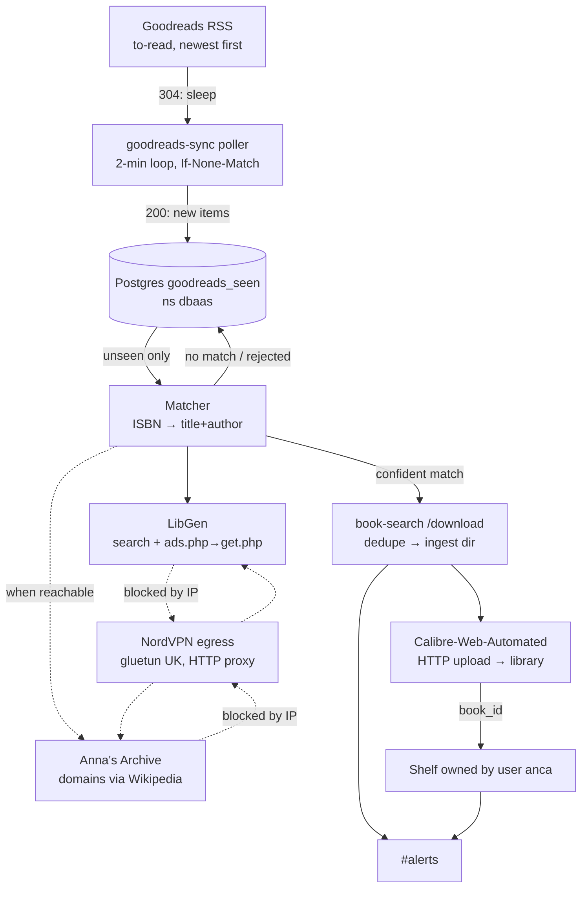

# Goodreads → Calibre auto-ingest for Anca

**Status:** built and live · **Date:** 2026-08-16 · **Owner:** Viktor
**Repo:** `book-search` · **Namespace:** `ebooks`

## What this delivers

When Anca adds a book to her Goodreads `to-read` shelf, it is found, downloaded, imported
into Calibre and placed on a shelf owned by her calibre-web account — within about two
minutes, with nobody in the loop. She does nothing differently; she keeps using Goodreads
exactly as she does today.

Scope boundaries: Kindle sending stays manual, there is no review or approval step, and the
existing interactive book-search UI behaves exactly as it does today.

## Starting state (verified live, 2026-08-15/16)

Each figure below was checked live during this session; a few earlier notes had gone out of date.

```stats
576 | books on her to-read shelf
3.2 | additions per week (2026)
77% | of recent adds carry an ISBN
76% | findable on LibGen today
```

**Goodreads side — nothing built yet.** `grep -ri goodreads ~/code` returns zero hits; today's
flow is a chat recipe, not code. The public RSS endpoint
`review/list_rss/33074940?shelf=to-read&per_page=100&sort=date_added&order=d` returns items
carrying title, author, ISBN, `book_id`, `user_date_added` and `user_shelves`.

| Measurement | Value | How it was obtained |
|---|---|---|
| Books on her `to-read` shelf | 576 | RSS pagination; her profile reports 591 |
| Additions during 2026 | 104 → ~3.2/week | grouped by `user_date_added` |
| Additions in August 2026 | 17 | same |
| ISBN present in last 100 adds | 77% | `isbn` field on the 100 newest items |
| Findable on LibGen today | 76% | matcher replay over her 25 newest adds |

**Feed mechanics.** The feed advertises no WebSub hub, so no true push subscription exists.
It does return a weak `ETag` and answers `If-None-Match` with `304 Not Modified`, which makes
frequent polling inexpensive — a quiet check costs a few hundred bytes instead of ~380 KB.

**Download side.** `book-search` (FastAPI, ns `ebooks`) already provides `/search`, `/download`,
`/api/download-url`, `/api/download-status`, `/api/send-to-kindle`, a `_cwa_login()` session
helper, `dedupe.py` (checks the Calibre library and ingest dir), and `_notify_slack()`.
Download job state is in-memory and does not survive a pod restart.

> [!WARNING]
> **LibGen is currently the only working source.** Anna's Archive, MyAnonamouse and the Stacks
> fast-download path all return nothing today, so the pipeline's delivered value rests on
> LibGen alone until one of them is restored.

**Source availability differs from what the code currently targets:**

- **Anna's Archive is unreachable from our egress.** Every AA search URL redirects to
  `&check=1`, DDoS-Guard's verification step, which returns `403` from both the cluster pod
  and the devvm on IP `176.12.22.76`. FlareSolverr solves Cloudflare, not DDoS-Guard, and
  reports "Error solving the challenge" for `.gd`, `.gl` and `.pk`. The shared headful Chrome
  (`homelab browser`, real Chrome + stealth.js) also lands on "Sorry, we could not verify your
  browser automatically". One `.org` fetch through FlareSolverr did succeed earlier in the
  session (249 KB, "Challenge not detected!"), so the path appears intermittent rather than
  uniformly closed.
- **MyAnonamouse session is expired** — `/mam-status` reports
  `{"authenticated": false, "msg": "Invalid session - Other"}`.
- **Stacks** is running but reports `fast_download: unavailable`; its last queue entry
  (2026-08-02) ended in a mirror failure.
- **LibGen works** and is currently the only live source. Its result rows mix mangled titles
  such as `Strange Houses9780063433168; 006343...` with records for unrelated books.
- **LibGen ISBN lookup works but isn't wired in yet.** `index.php?req=<isbn>` returns the correct
  edition record, but `_search_li()` pins `columns[]=["t","a"]`, so title/author is the only
  key in play today. ISBN results are *edition* rows; the file rows hang off `edition.php?id=`,
  which needs a second hop.

**Calibre side.** One shared library on NFS (410 books, `/calibre-library`). CWA users:
`admin` (Viktor), `anca` (kindle `ancaelena98_4RMJsy@kindle.com`), `mghe`, `Guest`. Existing
shelves include "Anca's Good read list (goodreads…)" (4 books) and "Anca" (3), both owned by
admin. `POST /shelf/add/<shelf_id>/<book_id>` requires `check_shelf_edit_permissions`, which a
public shelf grants to any account holding the edit-shelves role — so the admin session
book-search already uses can write to a public shelf owned by her user.

> [!IMPORTANT]
> **Why match strictness is the central concern.** A deliberately simple title+author matcher
> run over her 25 newest adds paired *"Untitled (A Court of Thorns and Roses, #6)"* with
> **The Journal of Roman Studies**, and *"Malachite"* with **Analytica Chimica Acta**; two
> further "hits" were raw HTML fragments. With no review step, the matching rules are the only
> thing standing between her shelf and a wrong book.

## Decisions

| Decision | Choice |
|---|---|
| Trigger shelf | `to-read` |
| Existing 576 books | Seeded as already-seen; no downloads. Backfill stays available as an explicit command |
| Destination | Calibre library + a shelf owned by her CWA user. No automatic Kindle send |
| Not-confident match | Skip. No review queue — the pipeline is fully autonomous |
| Retry policy | One attempt per book |
| Placement | New module in `book-search`, run as a small always-on poller |
| Watch cadence | 2-minute loop using conditional GET |
| State store | Shared Postgres (`pg-cluster`, ns `dbaas`) |
| Formats | epub preferred → azw3/mobi/fb2 → pdf last |
| Languages | English only |
| Anna's Archive | Domain list discovered dynamically from Wikipedia, then probed |
| Blocked by IP | Retry through NordVPN egress; one hardcoded instance until nordvpn-as-a-service lands |
| Reporting | `#alerts` only, and only when something happens |
| Go-live gate | Replay the matcher over ~50 of her books and hand-check before downloads are enabled |
| Shelf | id 6, "Goodreads wishlist", public, owned by calibre-web user `anca` |

## Architecture



## Poller

A small deployment in `ebooks` running the same image under a different command, separate from
the web pod so a stuck poll cannot affect the interactive UI.

```
loop:
  GET feed with If-None-Match
  304 → sleep 120s
  200 → assert channel <title> == "Anca E.'s bookshelf: to-read"
        diff item book_ids against goodreads_seen
        process unseen items, newest first, rate-limited
        store new ETag
```

The title assertion guards a known Goodreads behaviour: an invalid shelf slug does not error,
it silently serves the `read` shelf (526 books) with a trailing space in the channel title.
Without the assertion, one bad slug would look like 526 new additions. On mismatch the poller
posts once to `#alerts` and stops processing rather than acting on the wrong shelf.

## Matching rules

Applied per item; anything not clearing the bar is recorded and skipped.

1. **Placeholder guard.** Titles matching `^Untitled \(` are Goodreads placeholders for
   unannounced books and are skipped permanently.
2. **Already-owned guard.** The existing `dedupe.py` check runs first against the Calibre
   library and the ingest directory.
3. **ISBN key** (available for ~77% of items): `index.php?req=<isbn>` → edition record →
   `edition.php?id=` → file rows.
4. **Title + author key** for the rest: compare on normalized forms — Unicode-folded,
   lowercased, series suffix `(...)` and subtitle after `:` stripped, punctuation removed.
   The author surname must match, and the normalized title must match in full rather than by
   prefix or substring.
5. **Sanity filters.** Reject rows whose parsed cells contain HTML fragments, rows below the
   existing 5 KB floor, and any row whose language is not English.
6. **File choice** among surviving candidates: epub → azw3/mobi/fb2 → pdf, then the largest
   plausible file.

Everything downstream of the match reuses existing code: `/download` with `source=libgen`,
`_publish_ingest_file()`, the CWA HTTP upload, `_wait_for_calibre()` for the `book_id`, then
`POST /shelf/add/<shelf_id>/<book_id>` with the `_cwa_login()` session.

## Data model

```sql
CREATE TABLE goodreads_seen (
  book_id     TEXT PRIMARY KEY,        -- Goodreads book_id
  title       TEXT NOT NULL,
  author      TEXT,
  isbn        TEXT,
  added_at    TIMESTAMPTZ,             -- user_date_added from the feed
  outcome     TEXT NOT NULL,           -- seeded|downloaded|no_match|not_found|rejected|owned|error
  reason      TEXT,                    -- why, for the non-download outcomes
  md5         TEXT,
  calibre_id  INTEGER,
  processed_at TIMESTAMPTZ NOT NULL DEFAULT now()
);
```

The first run writes all 576 current items as `seeded`. Because outcomes are recorded rather
than inferred, a later backfill or a targeted re-run can select exactly the rows worth
retrying without redesigning anything.

## Anna's Archive and VPN egress

AA contributes nothing today, so the pipeline is designed to deliver its full value without
it. Two pieces of work make it opportunistic rather than hardcoded:

- **Dynamic domains.** Fetch AA's live domains from the Wikipedia article using a
  Wikimedia-compliant User-Agent (a generic browser UA gets `403` from datacenter IPs; a
  descriptive one returns `200`). The article currently lists `.gd`, `.gl` and `.pk`. Probe
  the candidates, cache the working one, and skip AA cleanly when none respond. This also
  replaces the hardcoded `.gl` constant in `annas.py`, which no longer resolves to a
  reachable endpoint.
- **Egress fallback.** A request that returns a block signature (403 plus a DDoS-Guard or
  Cloudflare interstitial) is retried through a NordVPN HTTP proxy. Implementation is one
  hardcoded gluetun instance with `SERVER_COUNTRIES="United Kingdom"` and `HTTPPROXY=on`,
  reachable at a single `VPN_PROXY_URL` env var so that repointing at the planned
  nordvpn-as-a-service is a one-line change. The NordLynx key comes from the same
  `api.nordvpn.com/v1/users/services/credentials` call the `proxy` stack already uses.

The same fallback covers LibGen if it is ever blocked, which is the more consequential case
since LibGen currently carries the whole pipeline.

## Reporting

`#alerts` receives one line when a book reaches her shelf, one line when a book was found but
rejected or could not be fetched (with the reason), and nothing on quiet cycles. Repeated
errors — a source down, the feed unreachable — are posted once and then suppressed until the
condition changes, so a broken dependency cannot produce a message every two minutes.

## What shipped

All four rollout steps are done.

1. **VPN egress** — measured separately and reverted; AA remains unreachable (see above).
2. **Matcher + gate** — 163 tests; replayed twice over 50 real shelf items, every pick
   checked by hand, two faults found and fixed.
3. **Database and shelf** — `goodreads_sync` on the shared cluster; shelf 6 owned by her
   calibre-web user. The first run seeded exactly **576** items and downloaded nothing.
4. **Downloads enabled** — live since 2026-08-16. The full path was also exercised by
   hand end to end: *Strange Houses* → LibGen → Calibre book 497 → her shelf.

Where it lives: `backend/goodreads/` in the book-search repo (`feed`, `matcher`, `sources`,
`store`, `sync`, `runner`, `replay`, `aa_domains`), deployed as the `goodreads-sync`
Deployment in the `ebooks` namespace.

Re-running the gate at any time:

```sh
python3 -m backend.goodreads.replay --limit 50
```

## What we learned building it

**Anna's Archive stays out of reach, and the VPN route does not help.** A separate
measurement through the new UK NordVPN egress compared blocked endpoints directly:
`annas-archive.gl` went 403 → 403, libgen error → error, Google Books 429 → 429.
NordVPN exits sit in hosting ASNs that anti-bot vendors score more harshly than a
residential address, so a datacentre exit does not beat a challenge the home IP
already fails. The egress service itself works; this consumer gains nothing from it.
The pipeline therefore runs on LibGen alone, as designed.

**The intermittent `.org` success has an explanation.** LibGen searches were dropping
roughly one connection in eight while the site was healthy, and a dropped connection
returned zero results — which reads exactly like being blocked. Both paths now retry.

**The go-live replay earned its place.** Over 50 real shelf items it produced 21
correct picks and no wrong ones, but only after two faults it exposed were fixed:

- The matcher treated *volume* markers as edition noise, so *In Search of Lost Time*
  matched "Volume 5: The Captive" — the right work, the wrong book. Volume and book
  numbers are now significant, which also stops a partial omnibus standing in for
  *1Q84* #1–3.
- A libgen timeout was indistinguishable from "this book does not exist", which under
  one-attempt-per-book meant a transient blip lost a book permanently. Source outages
  are now told apart from genuine absence and deferred to the next cycle.

**Two integration details only the live run could reveal.** `POST /shelf/add` answers
**204**, not 200, so the first version would have reported every successful shelving as
a failure. And a large import can still be in flight when the OPDS id poll gives up
after ~60s: a 24 MB epub imported correctly as book 497 but returned id `-1`, which
would have left it in the shared library and off her shelf. The id is now also read
from the Calibre database, which knows it as soon as the import commits.

**Measured hit rate is 42%, not the 76% the naive matcher suggested.** That first
number counted matches a strict matcher correctly refuses. Of 50 recent shelf items:
21 download, 20 are absent from LibGen, 8 have no confident match, 1 is an unpublished
placeholder.

## Known limitations

These follow from decisions above and are recorded so they are not surprises later.

- **New releases are usually missed.** Books published within the last few months are often
  absent from LibGen; one attempt per book means a title that appears later is not picked up.
  *May We Feed the King*, which she shelved on 9 August, is an example.
- **Romanian and French titles are skipped** under the English-only rule; two of her last 25
  additions fall into this group.
- **A pdf-only book is delivered as a pdf**, which reads poorly on a Kindle even though the
  import counts as a success.
- **The library is shared**, so her wishlist books appear in the same 410-book library you
  use. The shelf distinguishes them; the library does not.
