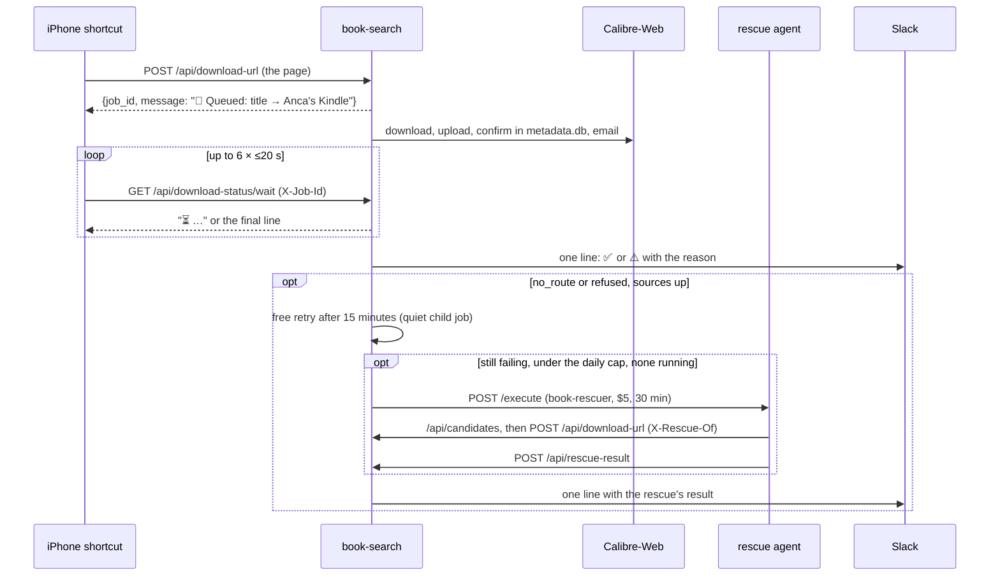

# Book shares that always say how they ended

**Status:** steps 1 to 4 live; step 5 (the new shortcut) waits on the London Mac · **Date:** 2026-09-24 · **Owner:** Viktor
**Repos:** `book-search`, `infra` (`stacks/ebooks`, `.claude/agents/book-rescuer.md`) · **Namespace:** `ebooks`

## Why

On the morning of 2026-09-24 Viktor shared two books for Anca's Kindle from his
phone, and neither arrived. He found out by asking. The shortcut showed nothing
after it posted, and Slack only heard about a share when it started, so a share that failed later produced no message on the phone or in Slack. Three fixes landed that
morning (the ingest cleanup race, a refused upload reported as added, and the
libgen title fallback), and this work covers the rest: every share now ends with
one answer, the known failures are retried in code, and a book the code still
cannot fetch goes to an agent.

## Decisions

Viktor's choices, 2026-09-24:

| question | answer |
|---|---|
| how long the phone waits | about two minutes, then the result lands elsewhere |
| where the final result lands | Slack, with an explicit success line as well as failures |
| rescue agent powers | full access, like an interactive session, up to $5 per book |
| when the agent runs | only after the automatic retries fail |
| push notifications | none through Home Assistant, which is separate from this work |

The plan first routed an iPhone push through a ha-sofia webhook. Viktor ruled
that out the same morning; the automation and its Vault key were removed
within minutes, the env entries never shipped, and Slack is the one place a
result lands once the phone stops waiting.

Decisions the plan added:

| decision | why |
|---|---|
| six waits of at most 20 s each | iOS gives up on "Get Contents of URL" at about 25 s, Traefik at 30 s |
| small state files on `/stacks-config/book-search` | book-search restarts on every deploy (11 rollouts over 2026-09-07 and 2026-09-24), and jobs, the send guard and rescues must outlive that |
| the Slack start line stays until the new shortcut is installed | it is the only instant confirmation of a pick until the phone shows one |
| at most 2 rescues a day, one at a time | `max_budget_usd` is a request field; this bounds real spend at $10 a day |
| the agent file lives in `infra/.claude/agents` | claude-agent-service resolves agents by name from its per-job infra checkout, so no image rebuild |

## How a share ends

## What is live

### One answer per share

- `_settle_job` is the one place a share ends. The Kindle step runs inside its
  own guard, the outcome is decided once, the job is marked finished (which
  wakes a waiting phone), and only then does Slack get its line, so a slow
  webhook never delays the phone. A success gets a line too:
  `✅ title → Anca's Kindle (epub, 34 s)`.
- `GET /api/download-status/wait` holds up to 20 s and always answers `200`
  in plain text. The job id rides in `X-Job-Id`, since a shortcut resolves only
  its first variable header; `?job_id=` works for anyone testing by hand. A PDF
  that Calibre is converting hands the phone over at once, and a literal
  `X-Last-Wait` header on the final ask points an unfinished answer at Slack.
- Every `/api/download-url` reply carries a `message`. A rejected share becomes
  a finished job whose waits repeat the real reason, and an internal error
  answers `200`, because the ingress error-pages middleware replaces 5xx
  bodies. A second share of a running book joins it and can add a Kindle to a
  Calibre-only job.
- A running job leaves `/stacks-config/book-search/jobs/<id>.json`. A pod that
  is stopping reports its unfinished jobs as lost in a restart; a pod that died
  without that chance leaves entries whose heartbeat stops, and the next pod
  reports them after 90 s.
- The book id the Kindle step sends is confirmed in `metadata.db`, with the
  EPUB's own title and author as a second key. `_upload_to_calibre` no longer
  polls OPDS for an id: that search leads with the author, and live on
  2026-09-24 it named Bill Perkins's *Die with Zero* for *The Yellow
  Wallpaper*. A share with no author matches only a row added after its upload.
- Finished jobs stay readable for 30 minutes; one with an open rescue stays
  until the rescue closes.

### Kindle send guard

- The same book goes to the same recipient at most once in 24 hours, whichever
  path sends it: the shortcut, `/api/send-to-kindle` or the Goodreads ingest.
  Each send is stored under the library row's id and under the book's title and
  author as the library records them, keeping every script and the subtitle, in
  `/stacks-config/book-search/sends.json`.
- A repeat is a skip, not a failure: a share ends `✅ … was already sent to
  Anca's Kindle at 07:18`, `/api/send-to-kindle` answers `409`, and Goodreads
  reports `kindle_skipped`. It never starts a rescue.
- `/api/send-to-kindle` accepts only configured recipients, by address or by
  name (`deliver_to`).

### Automatic retries

- An upload ends three ways. Calibre-Web unreachable (its login, a 5xx or the
  connection fails) stops the job at once with code `calibre_down`: no further
  downloads, no Stacks, no rescue.
- A file Calibre-Web refuses makes way for the next file of the same book, up
  to three uploads.
- A Kindle share of a PDF sends an EPUB (or AZW3/MOBI) of the same book when
  libgen has one, the original is listed as English, and it fits the mail
  limit; otherwise the PDF goes. The end line says `epub instead of the pdf`.
- Fork rotation was measured and dropped. In a sample of four files, all five
  live libgen forks sent each file to the same CDN host, so switching fork
  would not have routed around a failing one:

| file | li | la | bz | gl | vg |
|---|---|---|---|---|---|
| Flatland (epub) | cdn2 | cdn2 | cdn2 | cdn2 | cdn2 |
| The Legend of Sleepy Hollow (pdf) | cdn3 | cdn3 | cdn3 | cdn3 | cdn3 |
| Moby-Dick (pdf) | cdn2 | cdn2 | cdn2 | cdn2 | cdn2 |
| Remember Me (pdf) | cdn5 | cdn5 | cdn5 | cdn5 | cdn5 |

`libgen.is`, `.rs` and `.st` timed out on every probe.

### Rescue agent

- Only `no_route` (no file for the hash, no confident title match) and
  `refused` (Calibre refused every file) qualify, for a share with a usable
  title.
- Before anything is paid for, a breaker checks that libgen and Calibre-Web
  answer; if either does not, the end line says so and nothing is scheduled.
  Otherwise a free retry runs 15 minutes later as a quiet child job.
- If the retry fails the same way and the breaker passes again: at most two
  agents in any 24 hours and one at a time. The request is `book-rescuer`,
  `max_budget_usd` 5, 30 minutes, with a fixed-form prompt: failure code, md5s,
  recipient name, routes tried, and a title and author scrubbed to 120
  characters and labelled untrusted.
- The agent's own shares carry `X-Rescue-Of` and a token (an HMAC of the job
  id) in place of the API key. They go to the original share's recipient, post
  nothing and start no rescue. It lists libgen rows through `/api/candidates`
  and reports on `/api/rescue-result`; neither path is on the public ingress.
- The report line rests on what went through book-search: a claimed success
  with no delivered copy is posted as such. A watchdog polls the
  agent's job every minute and reports one that ends without a word, with its
  cost, or one the agent service lost.
- A share of a book under rescue gets the rescue's status. State lives in
  `/stacks-config/book-search/rescues.json` and resumes after a restart.

### Configuration

In `infra/stacks/ebooks/main.tf`: a single-property ExternalSecret
`book-search-agent` carrying claude-agent-service's `api_bearer_token`,
`CLAUDE_AGENT_URL`, `CLAUDE_AGENT_TOKEN` (optional), `RESCUE_DAILY_CAP=2`, and a
`smoke` recipient mapped to `spam@viktorbarzin.me` for tests. The agent's
runbook is `infra/.claude/agents/book-rescuer.md`.

## Checked on the live system

| check | what happened |
|---|---|
| Calibre-only EPUB share | `✅ Flatland … → Calibre (epub, 2 min)`; Calibre took 2m20s from upload to library |
| second EPUB share over the public URL | six 20 s waits passed through Cloudflare and Traefik; `✅ The Yellow Wallpaper → Calibre (epub, 2 min)` |
| Calibre-only PDF share | three progress answers, then the hand-over; the last three waits answered in 0.1 s |
| empty page | a `400` with the reason, repeated word for word by every wait |
| send guard | `200`, then `409 already sent to Smoke's Kindle at 09:18`; an unconfigured address `400` |
| restart mid-job | one line from the stopping pod: `The Legend of Sleepy Hollow was lost when book-search restarted` |
| Kindle share of a PDF | `✅ Treasure Island → Smoke's Kindle (epub instead of the pdf, 34 s)`, answered on the second wait |
| a file Calibre refuses | the Moby-Dick PDF was refused; the next file hit three 503s from its CDN and the share ended `refused` |
| right book | OPDS named book 307 for *The Yellow Wallpaper*; the library lookup found 515 instead |

Test books were deleted afterwards by the id each job recorded.

## Not done yet

- **The new shortcut (step 5).** It needs a spike on the iPhone rig and
  signing on the London Mac, and the Mac does not answer today
  (`homelab ios doctor` fails at ssh). Without a push channel the shortcut is
  simpler than first planned: post the page, show `message`, ask the wait
  endpoint up to six times with `X-Job-Id` (the last with `X-Last-Wait: 1`), and
  show the last answer; there is no acknowledgement call. Rotating the API key
  and removing the Slack start line go with that install.
- **Calibre-Web import time.** Three imports on 2026-09-24 took 2m06s to
  2m24s from upload to library, while later shares with a warm importer
  finished whole in 34 s and 37 s. That import time accounts for most of the
  EPUB timings above.

## Known limits

- With full access, as chosen, the agent can do anything the agent service's
  pod can: read Vault's `secret/*`, change deployments, reach Home Assistant.
  The daily cap, the breaker and the fixed-form prompt limit how often it runs
  and what reaches it; they do not narrow what it can do.
- claude-agent-service shares one bearer token across callers, and that token
  can start any agent with no budget. A budget clamp for callers other than the
  fixer would fit in claude-agent-service; it is outside this work and can be
  picked up in that repo.
- The EPUB swap only replaces a PDF that libgen lists as English, since the
  matcher offers English files only.
